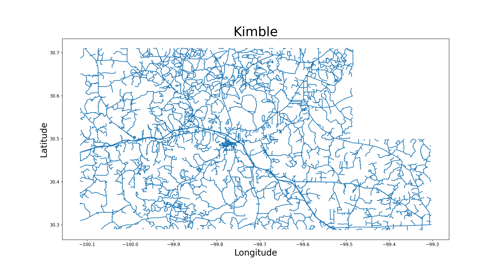

## Analysis

### Subgraphs
Inital Networkx analysis of the road network data of all four counties is summarized in Table 1

**Table-1 Networkx graph summary info for the four counties**
| County     |   No of nodes |   No of edges |   Average degree |
|:-----------|--------------:|--------------:|------------------:|
| Kimble     |          4284 |          3290 |            1.5359 |
| Menard     |          1851 |          1388 |            1.4997 |
| Schleicher |          4397 |          3989 |            1.8144 |
| Sutton     |          6379 |          5887 |            1.8457 |


The details for the number of subgraphs by the county are shown in Table 2

**Table-2 Networkx subgraph analysis results for the four counties**
| County     |   No of subs |   Nodes in sub0 |   % of nodes |
|:-----------|-------------:|----------------:|-------------:|
| Kimble     |         1205 |             119 |         2.78 |
| Menard     |          554 |              91 |         4.92 |
| Schleicher |          749 |             280 |         6.37 |
| Sutton     |          986 |             332 |         5.2  |

### Statistics
**Table-3 Mean and standard deviation of the linestrings for the four counties**
| County     |   Length (miles) |   Mean Length |    sd |
|:-----------|-----------------:|--------------:|------:|
| Kimble     |             2413 |         0.712 | 1.65  |
| Menard     |             1289 |         0.906 | 1.688 |
| Schleicher |             2639 |         0.647 | 1.531 |
| Sutton     |             3265 |         0.54  | 1.353 |



### Multiple Linestrings
**Table-4 Top five road names with number of linestrings in decending order for the Kimble County**
| Road Name     |   No of Linestrings |
|:--------------|--------------------:|
| I10 Svc Rd    |                  12 |
| Ranch Rd 1674 |                  10 |
| Lopez Ln      |                   6 |
| Kc 130        |                   6 |
| US Hwy 83     |                   6 |


**Table-5 The details of linestrings assigned to Kc 130 road in the Kimble County**
|   index |      LINEARID |   Length (miles) |
|--------:|--------------:|-----------------:|
|     566 | 1103690726563 |       1.70988    |
|     973 | 1103690726562 |       1.5133     |
|    2637 | 1103690726560 |       0.0954167  |
|    3039 | 1103671563060 |       0.0845677  |
|    3044 | 1103690726561 |       0.00871457 |
|    3045 | 1103671546765 |       0.00834386 |


### Analyzing linestrings to obtain single linestring
```python
import itertools
num = 6 # No of linestrings in Kc 130
x = np.linspace(0,num-1,num, dtype=int)
# We need pairs of the combinations
lst = (itertools.combinations(x, 2))
print (*lst)
(0, 1) (0, 2) (0, 3) (0, 4) (0, 5) (1, 2) (1, 3) (1, 4) (1, 5) (2, 3) (2, 4) (2, 5) (3, 4) (3, 5) (4, 5)
```
**Table-6 The list of linestrings after the removal of parallel ones
|   index |      LINEARID |   Length (miles) |
|--------:|--------------:|-----------------:|
|     566 | 1103690726563 |       1.70988    |
|     973 | 1103690726562 |       1.5133     |
|    3039 | 1103671563060 |       0.0845677  |
|    3045 | 1103671546765 |       0.00834386 |


**Originalsize**


**75 dpi**


The remaining four linestrings should be checked to find the order of melding them.  For this reason the _itertools_ function of Python is used again to generate the new combinations.

```python
import itertools
num = 4 # No of linestrings in Kc 130
x = np.linspace(0,num-1,num, dtype=int)
# We need pairs of the combinations
lst = (itertools.combinations(x, 2))
print (*lst)
(0, 1) (0, 2) (0, 3) (1, 2) (1, 3) (2, 3)
```
The script checking the _intersection_ of linestrings gave us a list of pairs where the snapping should be done in order to produce a single linestring out of these pairs.  The row numbers are given as [1, 4, 5] which are (0, 2), (1, 3) and (2, 3). A simple approach is followed in getting this order automatically.  We benefitted from the graph formation in Networkx, it can give us the order of these linestrings by locating the node numbers with single occurence at two ends of the graph. When a shortest path node list is asked, it provides the exact linestring order that we needed.  

### Applying the crossing point script

**Table-7 Crossing points along the Kc 130 linestring** 
|   Cross Rd Index | Cross Rd Name     |   Latitude |   Longitude |
|-----------------:|:------------------|-----------:|------------:|
|              158 | Co Rd 130X        |    30.3925 |    -99.9385 |
|              571 | Weisenburg Rd     |    30.3925 |    -99.9385 |
|              982 |                   |    30.3912 |    -99.9297 |
|             2195 | US Hwy 377        |    30.3834 |    -99.8906 |
|             2202 | Oasis Pipeline Rd |    30.3826 |    -99.8967 |
|             2626 |                   |    30.3903 |    -99.9262 |
|             3040 |                   |    30.3809 |    -99.9022 |
|             3041 |                   |    30.3809 |    -99.9071 |


The graph generation process in Networkx connects the edges by common nodes,in the case of TIGER/Line dataset the nodes are represented by the coordinates.  If the end coordinates of two neighboring edges are identical, we can incude these edges in the same graph.  Any minor difference may result in keeping them in separate graphs, with the terminology in Networkx, subgraphs. By definition, an edge in one subggraph is not connected to an edge in another eventhough they may be only tens of meters apart. To illustrate this let's look at two plot where we have two subgraphs in one figure and replacement of these two subgraphs into one thru end coordinate truncation.


Truncation has to be applied carefully, to prevent alignment changes of the road sections. 


[Back to Poster Navigation Board](./poster_nav.md#Outline)
