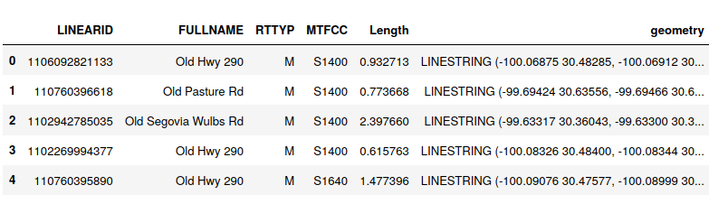

## Data

In this study the road network data is obtained from [TIGER/Line Shapefiles](https://www.census.gov/cgi-bin/geo/shapefiles/index.php?year=2019&layergroup=Roads) for **Kimble, Menard, Schleicher and Sutton counties** of the state of Texas. The data sets can be fetched directly using the [Census FTP](https://www2.census.gov/geo/tiger/TIGER2019/ROADS/)  where the data files are named with Federal Information Processing Standards ([FIPS](https://en.wikipedia.org/wiki/Federal_Information_Processing_Standards)) code of each [county](https://tx.postcodebase.com/state_county). If you prefer to fetch multiple county road datasets you may use [census_fetcher.py](https://gist.github.com/flibbertigibbet/8092460) by Kathryn Killebrew.  

The data, originally set in shapefile (.shp) format, was converted into a dataframe with GeoPandas for further processing.  Part of the data for Kimble county road network is depicted in the following figure

Instead of using other open source data such as [OpenStreetMap](https://download.geofabrik.de/index.html), we decided to use **TIGER/Line datasets** due to **better rural area road network coverage**. Hence, a larger area of coverage in spatial information allowed for more details into the infrastructure available. 

[Back to Poster Navigation Board](./README.md#Outline)
