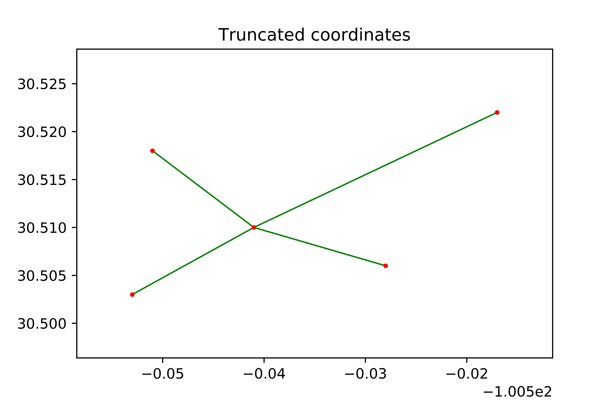

# Role of linestring modification in prevention of road network subgraphs
Mehmet Kunt<sup>1</sup>,PhD, Jennifer Zuehlke<sup>2</sup>, Randy Machemehl<sup>2</sup>, Phd, PE

<sup>1</sup>[Eastern Mediterranean University](https://www.emu.edu.tr/en), <sup>2</sup>[The University of Texas at Austin](https://www.utexas.edu/)

This is a repository for purposes of presenting the SciPy2020 Poster at [SciPy2020](https://www.scipy2020.scipy.org). All the scheduled presentations can be viewed at [SciPy2020 Schedule](https://na.eventscloud.com/ehome/487022?&t=d2917a15274e1daf79d80a4253f01e7a).


## Contents of the Presentation


## Summary
In this study, we used coordinate truncation in TIGER/Line datasets for roads to prevent the formation of subgraphs to ensure a connected graph for network analysis. The method consists of writing code to perform truncation of end coordinates, segmentation of linestrings at the intersection points, and identification of the original linestring to the segments. Overall, the results show improved network connectivity and better performance in finding shortest paths with Networkx. Part of the road network in the state of Texas is being used to demonstrate both the effect of multiple subgraphs and the improvement comes with the proposed approach.

## Objective
This study is aimed to develop an algorithm entirely in Jupyter notebooks for pre-processing TIGER/Line dataset to increase network completeness through coordinate truncation and proper segmentation of linestrings.  The developed approach is expected to prevent multiple subgraph formation for a given road network and allow shortest path analysis.  

## Data

The road network data is obtained from [TIGER/Line Shapefiles](https://www.census.gov/cgi-bin/geo/shapefiles/index.php?year=2019&layergroup=Roads) for the selected counties of the state of Texas. The data sets can be also fetched directly from the [Census FTP](https://www2.census.gov/geo/tiger/TIGER2019/ROADS/) by using the [county FIPS number](https://tx.postcodebase.com/state_county). If you prefer to fetch multiple county road datasets you may use [census_fetcher.py](https://gist.github.com/flibbertigibbet/8092460) by Kathryn Killebrew. In this study we decided to use TIGER/Line datasets instead of other open source data such as [OpenStreetMap](https://download.geofabrik.de/index.html) due to better rural area coverage provided by the former source. While volunteers work on 

## Analysis

Inital Networkx analysis of the road network data of all four counties is summarized in Table 1
**Table-1 Networkx graph summary info for the four counties**
| County     |   No_nodes |   No_edges |   Avg_degree |
|:-----------|-----------:|-----------:|-------------:|
| Kimble     |       4284 |       3290 |       1.5359 |
| Menard     |       1851 |       1388 |       1.4997 |
| Schleicher |       4397 |       3989 |       1.8144 |
| Sutton     |       6379 |       5887 |       1.8457 |

The details for the number of subgraphs by the county are shown in Table 2

**Table-2 Networkx subgraph analysis results for the four counties**
| County     |   No_subs |   Nodes in sub0 |   % of nodes |
|:-----------|----------:|----------------:|-------------:|
| Kimble     |      1205 |             119 |         2.78 |
| Menard     |       554 |              91 |         4.92 |
| Schleicher |       749 |             280 |         6.37 |
| Sutton     |       986 |             332 |         5.2  |


The graph generation process in Networkx connects the edges by common nodes,in the case of TIGER/Line dataset the nodes are represented by the coordinates.  If the end coordinates of two neighboring edges are identical, we can incude these edges in the same graph.  Any minor difference may result in keeping them in separate graphs, with the terminology in Networkx, subgraphs. By definition, an edge in one subggraph is not connected to an edge in another eventhough they may be only tens of meters apart. To illustrate this let's look at two plot where we have two subgraphs in one figure and replacement of these two subgraphs into one thru end coordinate truncation.




Truncation has to be applied carefully, to prevent alignment changes of the road sections. 


## Codes


An example code is given below, which will be replaced with actual codes from the study.
```python
import pandas as pd
import geopandas as gpd
import shapely
```

## Tables
The tables are obtained from pandas dataframes with `df.to_markdown()`command.

Sample table

| Row  |    A |    B |
| :--- | ---: | ---: |
| a    |    1 |    1 |
| a    |    2 |    2 |
| b    |    3 |    3 |

## Conclusion

 In this study an algorithm is developed with the aim of solving the multiple subgraph existence problem in *Networkx*. The approach is developed to address the needs of the agencies such as Texas Department of Transportation (TxDOT) such as providing proper ID for the segments so relevant attribute values can be assigned.    


#### Maps of the Kimble County


